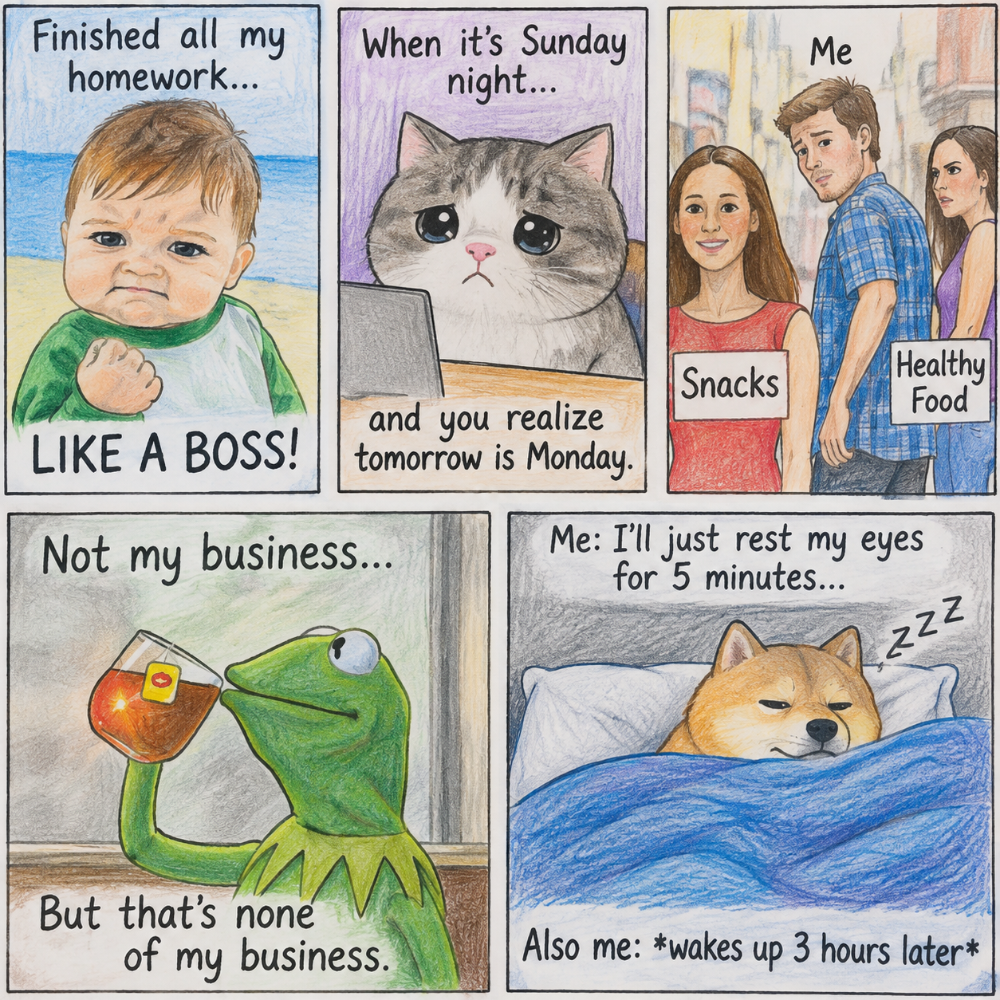
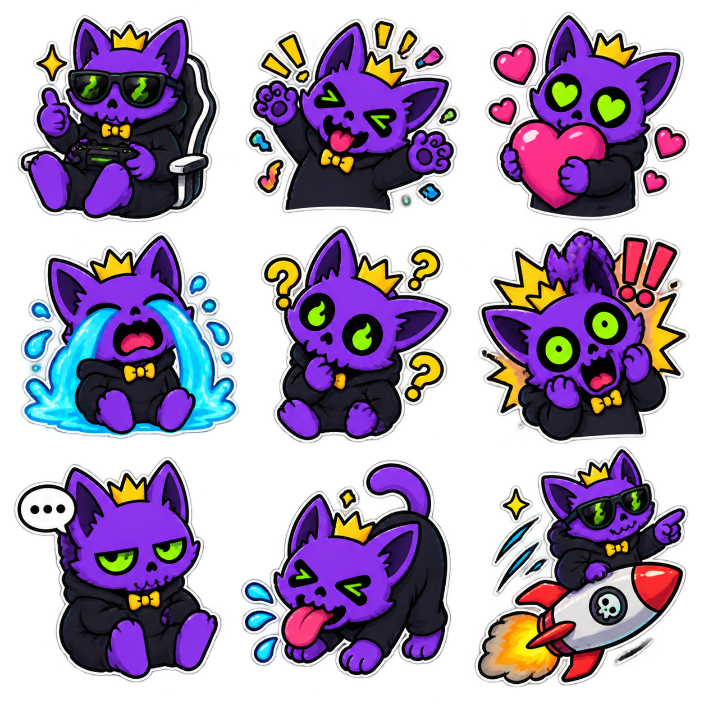
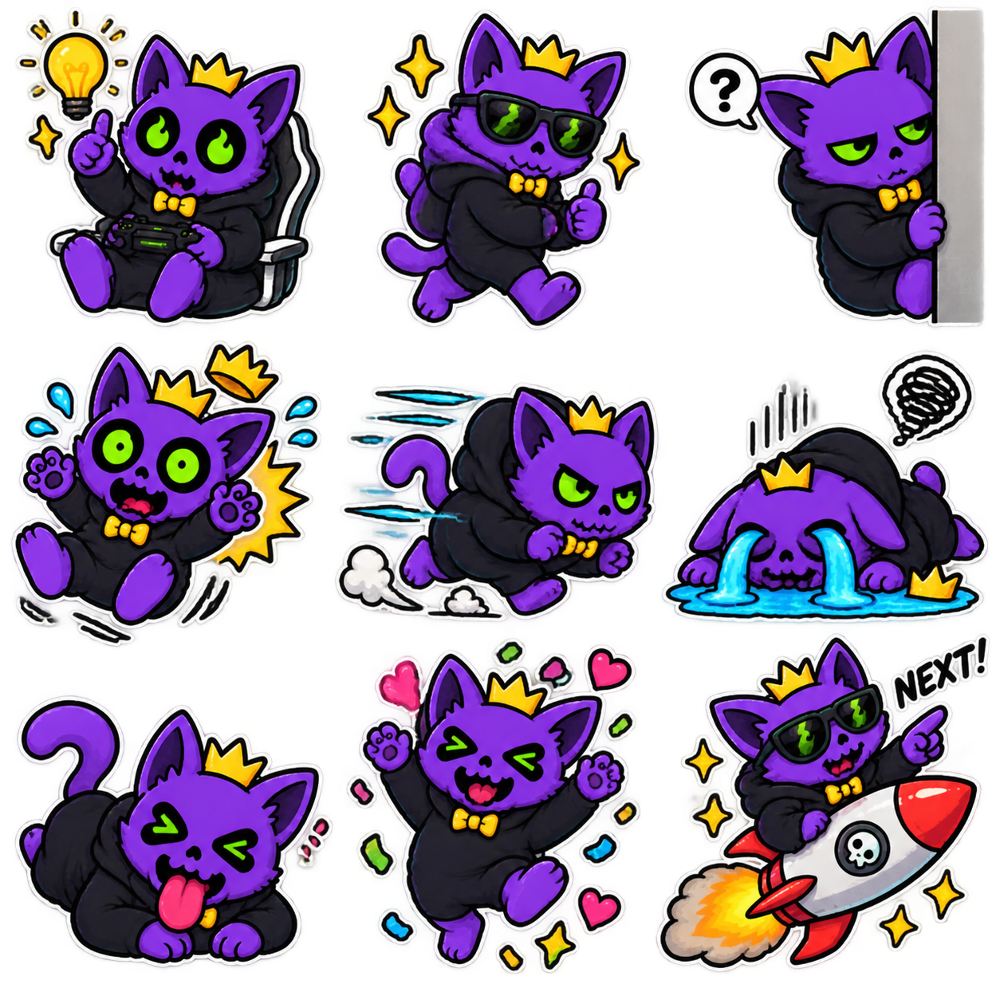
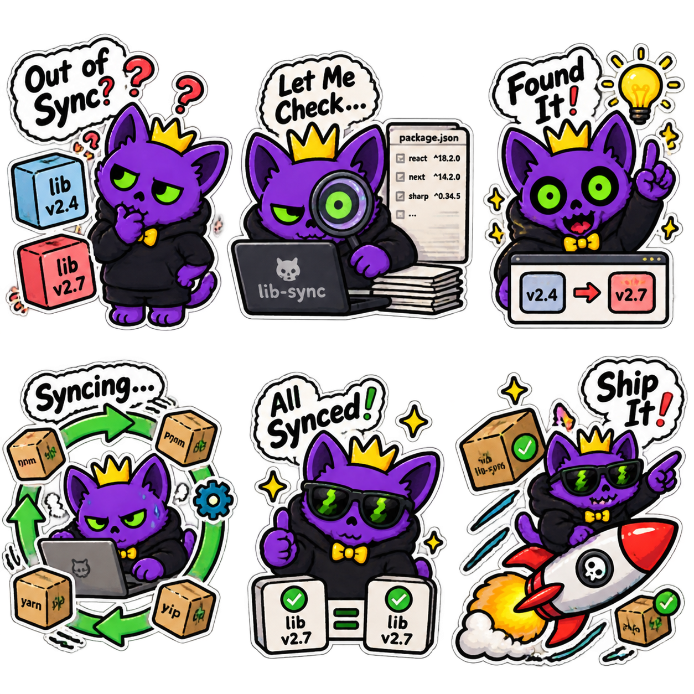

# Visual Style

## Core look

- Drawing medium: Procreate
- Style description: Hand-drawn colored-pencil illustration on off-white paper with visible texture, slightly imperfect black outlines, expressive subjects, and a warm editorial-storybook character
- Line weight: Thick black primary contours for clear silhouettes, with lighter internal detail lines; mascot cutouts may add a white sticker-like keyline
- Palette: Off-white paper and charcoal-black lines; muted earth tones for historical scenes with one bright accent; recurring mascot uses purple, warm gold, and lime green
- Background treatment: Simple, lightly rendered backgrounds that establish context without competing with the main subject
- Texture/shading: Keep visible colored-pencil grain and uneven fill; avoid overly smooth digital gradients and photorealistic rendering

## Visual grammar

- Character proportions: Use an oversized head and compact body for the recurring mascot; keep historical people distinct and simplified without forcing them into the mascot proportions
- Facial expressions: Clear and exaggerated enough to communicate the emotional beat immediately through eyes, mouth, and pose
- Motion indicators: Use a small number of hand-drawn speed lines, impact bursts, tears, sparkles, or emotion symbols; preserve a readable silhouette and avoid decorative clutter
- Labels/arrows/callouts: Use short hand-lettered labels, simple arrows, checkmarks, and speech or thought bubbles with high contrast and generous spacing
- Maps, timelines, and diagrams: Reduce explanations to a clear visual sequence using boxes, arrows, and highlighted states; favor left-to-right reading when chronology or causality permits
- On-screen text limit: Maximum 8 words and 2 lines per caption; map and diagram labels should usually be 1–3 words

## Reuse rules

- Search `assets/` before adding a drawing.
- Prefer pose/expression variants over entirely new characters.
- Record each reusable asset with a stable name, category, tags, source file, and usage notes.
- Keep the episode-specific drawing list small enough to finish consistently.

## Accessibility

- Maintain readable contrast.
- Do not rely on color alone to communicate meaning.
- Keep text large enough for mobile viewing.
- Avoid rapid flashing and visually ambiguous diagrams.

## Human approval

Add 3–5 visual references and describe what to adopt and what to avoid.

### Reference 1 — Colored-pencil panel illustration

- Adopt: visible colored-pencil texture, off-white paper, slightly imperfect black outlines, simple backgrounds, expressive faces, subject-forward composition, and hand-lettered captions placed in clear reserved areas.
- Avoid: photorealistic rendering, crowded scenes, overly smooth digital gradients, tiny text, rigid vector-perfect lines, and copying recognizable meme characters or compositions.

### Reference 2 — Mascot expression library

- Adopt: a recurring chibi mascot with a strong silhouette, oversized head, compact body, reusable poses, and instantly readable eye and mouth expressions.
- Avoid: copying the exact purple-cat design, using excessive neon color, or letting reaction symbols overwhelm the character.

### Reference 3 — Mascot action library

- Adopt: thick black contours, an optional white sticker-like keyline, economical motion lines, and a small set of props and symbols that clarify the action.
- Avoid: decorative clutter, ambiguous poses, and using the mascot to trivialize suffering or dominate serious historical moments.

### Reference 4 — Mascot-assisted diagram sequence

- Adopt: short labels, boxes, arrows, checkmarks, and a clear problem-to-investigation-to-solution sequence; use the mascot as a guide through the information.
- Avoid: tiny technical text, overpacked diagrams, subject matter copied from the reference, and using the mascot as a substitute for evidence.
